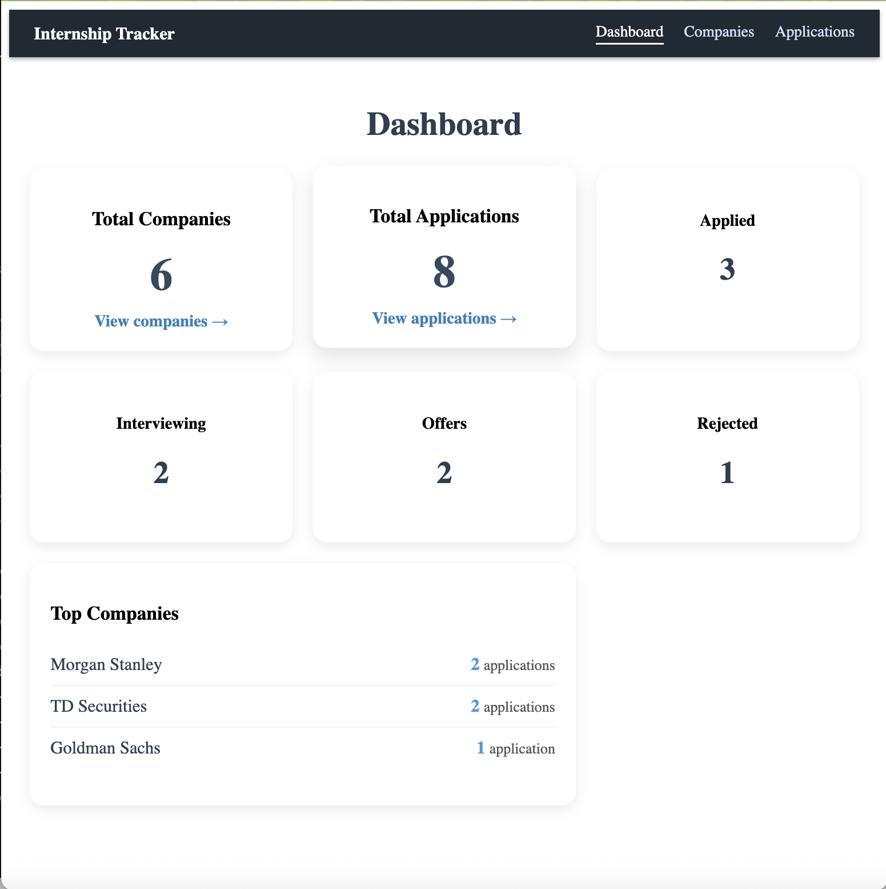
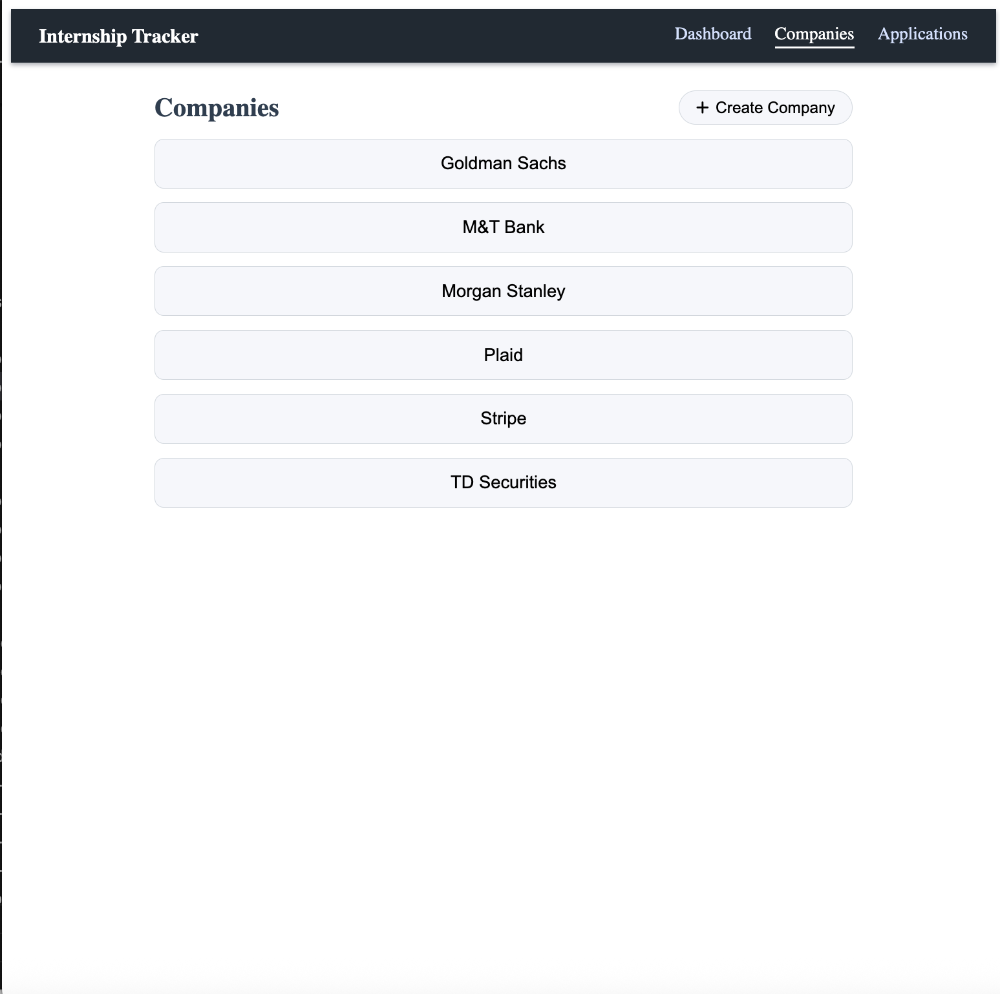
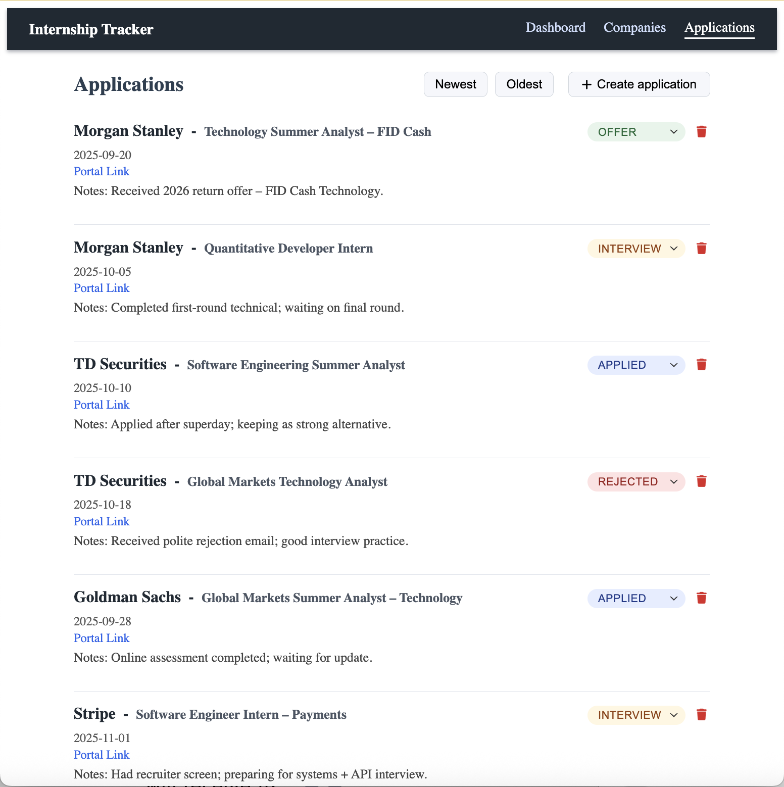
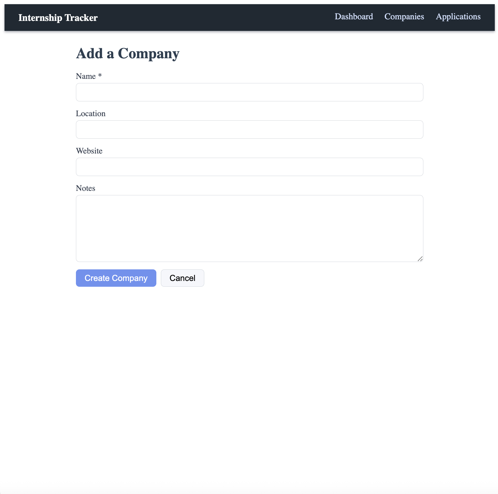
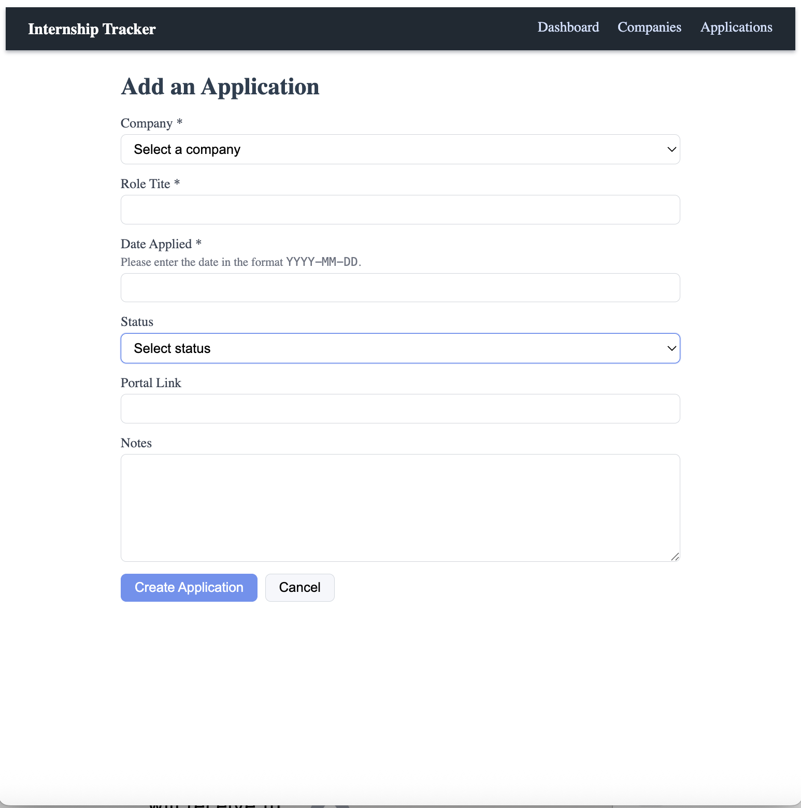

# 📌 Internship Tracker — Frontend (Angular)

This is the **frontend web application** for the Internship Tracker — a project designed to help track internship applications, companies, and progress across recruiting cycles.  
Built with **Angular Standalone Components**, it provides a clean and responsive interface with full CRUD features.

> **Related Repository**: [Internship Tracker Backend (Spring Boot)](https://github.com/e2sun/internship-application-tracker)

Note: ChatGPT was used to assist in styling.

---

## 🚀 Features

### 📁 Companies
- View list of all companies  
- Create companies  
- Delete companies  
- View company details  
- Applications under each company shown in detail view  

### 📝 Applications
- View all applications  
- Create applications  
- Auto-select company when creating from the company page  
- Update application status  
- Delete applications with modal confirmation  
- Sort by newest or oldest  
- Color-coded status badges (Applied/Interview/Offer/Rejected)

### 📊 Dashboard
- Total companies  
- Total applications  
- Application counts by status  
- Top companies ranked by number of applications  

---

## 🛠️ Tech Stack

- **Angular 17**
- **TypeScript**
- **Standalone Components**
- **Template-driven forms**
- **Angular Router**
- **Font Awesome**
- **Custom CSS**

---

## 📂 Project Structure
```
src/app/
├── components/
│   ├── dashboard/
│   ├── company/
│   ├── company-detail/
│   ├── applications/
│   ├── applications-list/
│   ├── create-company/
│   └── create-application/
│
├── services/
│   ├── company.service.ts
│   └── application.service.ts
│
├── models/
│   ├── company.model.ts
│   └── application.model.ts
│
└── app.routes.ts
```

---

## ▶️ Running the Frontend

### 1️⃣ Install dependencies  
```bash
npm install
```

### 2️⃣ Start the dev server
```bash
npm start
```

### 3️⃣ Open in browser
```
http://localhost:4200
```

**Backend must be running at http://localhost:8080.**

---

## 🔗 API Base URL
```
http://localhost:8080/api
```

---

## 🖼️ Screenshots








---

## ⭐ Future Enhancements

- User authentication
- Resume uploads per application
- Detailed activity notes per company
- Dark mode toggle
- Filtering & advanced sorting

---

## 🏁 Status

Stable, fully functional frontend for the Internship Tracker.
